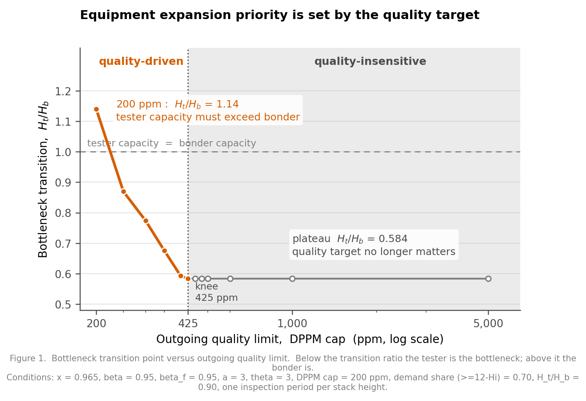
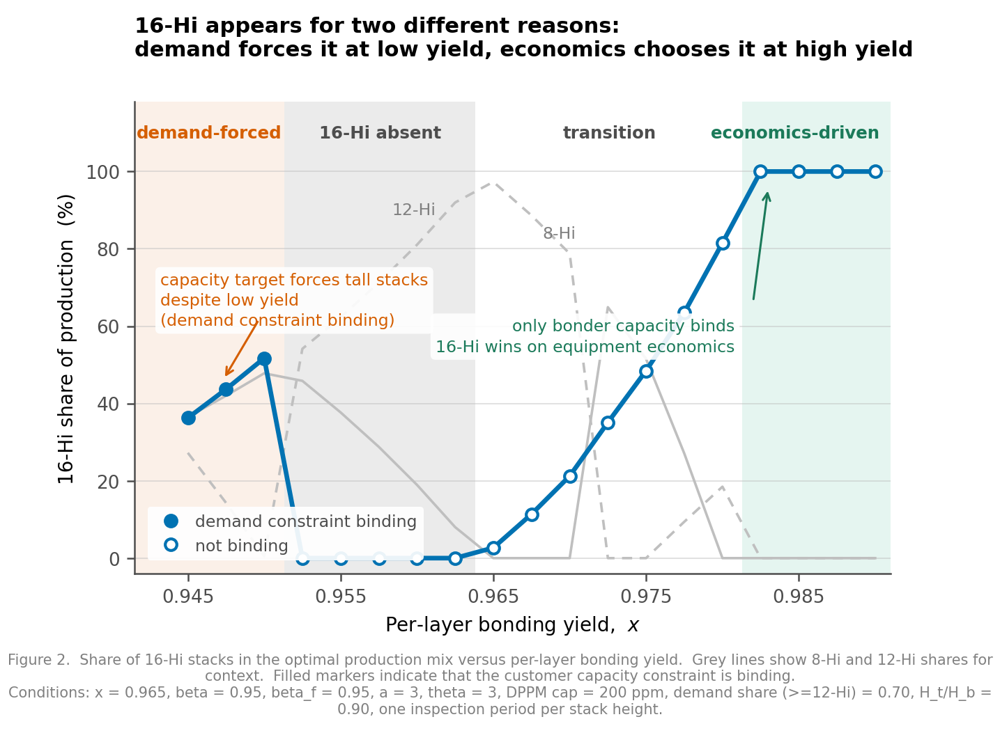
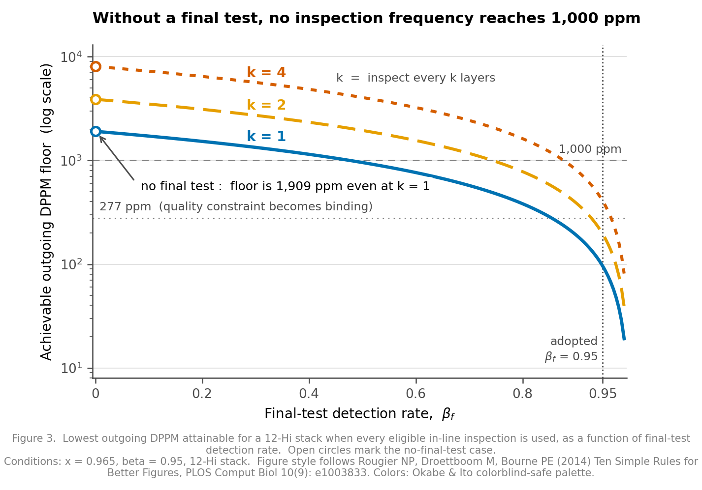

# HBM Stack Mix Optimization

**제한된 후공정 설비에서 층수 구성과 층 단위 검사 주기를 동시에 결정하는 MILP 모델**

HBM(고대역폭 메모리)은 DRAM 칩을 여러 장 쌓아 만든다. 높이 쌓을수록 용량은 크지만 실패 확률이 곱셈으로 누적된다. 쌓는 도중 검사를 넣으면 불량을 일찍 버려 설비 시간을 아낄 수 있으나, 검사 자체도 설비 시간을 쓴다.

> **설비 한 단위를 더 높이 쌓는 데 쓸 것인가, 더 자주 검사하는 데 쓸 것인가.**

본 연구는 본더·테스터의 처리량 제약 아래에서 **8/12/16단 생산 배분과 검사 주기(k ∈ {1, 2, 4})를 하나의 목적함수로 동시에 결정**한다.

---

## 대표 결과

<p align="center">
  
</p>

**① 설비 증설 우선순위는 품질 목표가 정한다.**
출하 품질 목표가 **425 ppm보다 느슨하면** 병목 전환점이 0.584로 고정돼 품질과 무관하다. 그보다 조이면 급증하며, **200 ppm에서는 1.140** — 테스터 캐파가 본더보다 커야 한다. 품질을 조이면 사야 할 장비가 바뀐다.

<p align="center">
  
</p>

**② 16단은 서로 다른 두 이유로 등장한다.**
층당 접합 수율이 낮은 구간에서는 **고객 용량 수요가 강제**해서, 높은 구간(x ≥ 0.9825)에서는 **설비 경제성이 선택**해서 나타난다. 그 사이에는 0%다. 채워진 마커가 수요 제약이 구속된 지점이다.

<p align="center">
  
</p>

**③ 검사 빈도로 검사 정확도를 대체할 수 없다.**
최종 검사가 없으면 매 층 검사(k=1)를 해도 출하 불량률 하한이 1,909 ppm이다. 어떤 검사 빈도로도 1,000 ppm 아래로 내려가지 않는다. MILP 이분탐색으로 구한 실행가능 하한이 닫힌형 계산과 소수점까지 일치한다.

**④ 병목이 검사 전략을 뒤집는다.**
본더가 병목이면 검사를 최대로(k=1), 테스터가 병목이면 최소로(k=4) 하는 것이 최적이다. 본더가 병목일 때는 테스터 시간이 사실상 공짜이므로, 자주 검사해 불량을 일찍 버리고 본더 시간을 아끼는 편이 이득이다. 조기 폐기 모델이 극단값에서 재현된 결과다.

**⑤ 무엇을 정확히 측정해야 하는지가 갈린다.**
파라미터 9개를 삼각분포로 동시에 흔든 몬테카를로 2,000회 결과, 층수 구성은 **층당 접합 수율 x**(상관 +0.476)가, 병목 위치는 **검사시간 배수 θ = t_test/t_stack**(+0.417)이 지배한다. 반면 원가 항목은 상관 0.06 미만으로, 50% 틀려도 결론이 바뀌지 않는다.

전체 논의는 **[최종 리포트 — `docs/11_Report.md`](docs/11_Report.md)**에 있다. 수치의 정본은 [`docs/07_Results.md`](docs/07_Results.md)다.

---

## 선행연구 대비 위치

3D 적층 원가 모델과 test flow 선택 최적화는 이미 확립된 계보가 있다. 본 연구의 위치는 **"아무도 하지 않았다"가 아니라 "그 계보가 후속 과제로 남긴 것을 생산관리 관점에서 다룬다"**이다.

| # | 차별점 | 선행연구 상태 |
|---|---|---|
| 1 | **설비 처리량 캐파 제약** | 계보 전체가 원가만 다루며 시간 개념이 없다. 테스트 비용을 패턴 수로 대리 측정한다 |
| 2 | **층수가 다른 이질적 제품의 설비 공유** | 전부 단일 제품·단일 스택. 하나의 설비 위에서 여러 층수 구성을 동시에 다루지 않는다 |
| 3 | **층수를 결정변수로** | 층수 l은 주어진 파라미터다 |
| 4 | **대규모 스택 계산 가능성** | 탐색공간이 O(N^(l²))로 증가해 실험 규모가 최대 5-die에 머문다 |

차별점 ②에는 결과 측면의 발견이 따로 있다.

> **층수를 다양화하는 것과 검사 주기를 다양화하는 것은 서로 대체재다.**

층수당 검사 주기를 하나로 묶는 제약을 풀어 12단이 k=2와 k=4를 동시에 가질 수 있게 하면 **16단이 사라지고 12단 k=4가 그 자리를 대신한다**(16단 32% → 0%, 12단 k=4 0% → 29%). 두 축은 독립이 아니며, 층수와 검사를 **동시에** 결정변수로 놓았기 때문에만 보인다.

> 이 대조는 DPPM 상한 5,000 ppm · β_f 미도입 설정에서 수행한 것이다 (`data/single_k_log.txt`). 제약 해제의 기회비용은 총이익 +0.11%(품질 제약 적용) ~ +1.43%(미적용)로, **라인 운영 현실을 반영한 대가가 1.5% 이내**임을 뜻한다.

상세 논거와 문헌 지형도는 [`docs/01_Spec.md`](docs/01_Spec.md) 6절, 참고문헌 20편은 11절에 있다.

---

## 한계 — 먼저 밝힌다

**이 연구의 입력은 데이터셋이 아니라 파라미터 공간이다.** 후공정 설비의 시간·원가 계수는 절대값이 전부 비공개이므로, 공개 문헌으로 확보 가능한 범위를 삼각분포로 두고 확률적으로 보고한다. 결론은 점추정이 아니라 **임계 조건과 신뢰구간**이다.

| 항목 | 상태 |
|---|---|
| 설비 시간·원가 계수 (a, θ, r, c_base, c_fix_b) | **미확보.** 공개 자료에 절대값 없음. 삼각분포 시나리오로 처리 |
| 검사 검출률 β | 범용 칩렛 문헌(CATCH)의 coverage sweep 값. HBM KGD 실측 아님 |
| 최종 검사 검출률 β_f | 존재는 문헌으로 확증, 수치는 역산값 |
| 업계 출하 DPPM 목표 | 미확보. **업계 값과의 직접 비교는 수행하지 않았다** |
| 8단 등장 메커니즘 | **미규명.** 저 DPPM 체제에서만 등장하며 결론에 영향 없음 |
| 층수당 단일 검사 주기 제약 | 라인 운영 현실 반영(현장은 규칙적 주기로만 검사한다). 기회비용 1.5% 이내로 정량화. 다만 **전환 구간의 층수 배분은 이 설정에 민감하다** |

따라서 **"최적 층수는 12단이다"라고 말할 수 없다.** 몬테카를로 90% 신뢰구간이 0~100%다. 이는 결함이 아니라 위 설계의 귀결이며, 대신 **답이 뒤집히는 임계 조건**을 제시한다.

파라미터마다 A(문헌·표준) / B(업계 자료 추론) / C(가정) / 미확보 등급을 부여했다. [`docs/06_Parameters.md`](docs/06_Parameters.md) 참조.

---

## 모델

**목적함수** — 총이익 최대화. 생산량 전량 판매를 전제한다.

```
max  Σ ( 매출(L) − E[원가](L,k) ) · q(L,k)
```

분수형(설비시간 단위당 이익)을 쓰지 않는다. 규모에 무관하므로 캐파 제약이 구속되지 않고 병목 판정이 정의되지 않기 때문이다. 대신 **캐파 제약의 shadow price가 곧 설비 1초의 한계이익**이며, 이 등식을 검증 8번에서 소수점 다섯 자리까지 확인했다.

**제약**

| | 내용 |
|---|---|
| C1-a / C1-b | 본더 / 테스터 처리량. **분리하는 것이 병목 판정의 전제다** |
| C2 | 고객 용량 수요 (GPU당 HBM 슬롯 수 고정) |
| C3 | 웨이퍼 공급 |
| C4 | 출하 품질 상한 (DPPM) |

**검사 효과는 조기 폐기 하나로 한정한다.** 불량을 일찍 발견해 이후 층의 적층·검사 시간을 아끼는 경로이며, 수리(repair)는 범위 밖이다.

모듈은 **Block Y**(수율·검사)와 **Block T**(설비·원가)로 나뉘고 서로 데이터를 주고받지 않는다. 결합은 한 곳에서만 한다. 인터페이스 규약은 [`docs/04_Interface.md`](docs/04_Interface.md).

---

## 검증

| 번호 | 항목 | 결과 |
|---|---|---|
| 1–6 | Block Y 범위·항등식·k 불변성·단조성·극단값 | PASS |
| 7 | 고정시간 배수 a → 0 이면 최소 층수 유리 | PASS |
| **8** | **문헌 재현** — 캐파를 단일 풀로 되돌리면 선행연구 결론이 나오는가 | **PASS.** 층수 내부 최적점 재현, 캐파 듀얼이 직접 계산과 일치 |
| 9 | 단위 정합 | PASS |

검증 8이 유일한 치명 관문이었다. 캐파 제약을 빼면 선행연구와 같은 문제가 되어야 하며, 다른 답이 나오면 모델이 틀렸거나 차별점 서술이 과장된 것이다.

그림에는 별도의 자동 검수를 적용했다. 렌더러로 텍스트 경계 상자를 계산해 축 이탈·텍스트 겹침·데이터 선 관통을 검사한다(`src/fig_audit.py`).

---

## 재현

```bash
pip install -r requirements.txt
python src/run_all.py          # 전체 재현, 약 4분
python src/run_all.py --list   # 단계 목록
```

`data/`와 `figures/`의 모든 산출물이 이 스크립트 하나로 재생성된다. 선형계획 솔버는 PuLP에 동봉된 CBC를 쓰므로 별도 설치가 필요 없다.

```
1. gate0_threshold.py    Gate 0 — Block Y 검증 6종 + 층수 최적점 존재 조건
2. milp.py               결합층 + MILP, 통합 검증 7·8·9
3. scenarios.py          시나리오 A~F + 파라미터 몬테카를로 + 정보가치
4. scenario_g.py         DPPM 상한 스윕, 실행가능 하한, 최적 k 전환점
5. demand_segments.py    수요 세그먼트 역산, 수요 제약 구속 판정
6. transition_point.py   병목 전환점 이분탐색
7. transition_curve.py   전환점 궤적 (그림 1 데이터)
8. mix_vs_yield.py       수율 스윕 (그림 2 데이터)
9. make_figures.py       대표 그림 3장
10. fig_audit.py         그림 자동 검수
```

---

## 저장소 구조

```
docs/       학술 문서
  00_Proposal.md      문제 설명 — 전문용어 없는 판
  01_Spec.md          모델 사양 · 차별점 · 문헌 지형도 · 참고문헌
  04_Interface.md     모듈 인터페이스 규약
  06_Parameters.md    파라미터 표 · 등급 · 출처 · 출처 충돌
  07_Results.md       ★ 결과 정본
  09_Roadmap.md       실행 계획
  11_Report.md        ★ 최종 리포트 — 초록·선행연구·모델·검증·결과·한계

notes/      작업 기록
  08_Handoff.md          세션 인계 메모
  10_Work_Order.md       미결 과제 지시서
  verification_notes.md  실험 노트 (시간순)

src/        코드 — 코어 3 · 분석 6 · 그림 2 · 검증 4 · 실행 1
figures/    대표 그림 3장 (200 dpi)
data/       산출물 17
  archive/            파라미터 정정 전 로그 — 결론 불변을 대조하기 위한 기록 (설명은 해당 폴더 README)
archive/    구 그림 스크립트
```

**문서 번호 02·03·05가 비어 있는 것은 누락이 아니다.** 이전 버전에서 쓰던 번호이며 현행에서 의도적으로 만들지 않았다. 선행연구는 `01_Spec.md` 6·11절에, 리스크는 8.2·10절과 `09_Roadmap.md` 8절에 통합돼 있다.

이 저장소는 **2026.08.11 원점 재검토 이후의 문제정의만** 담는다. 그 이전 버전(HBM KGD Test Strategy)은 층수 구성이 아니라 검사 횟수만을 다뤘고 설비 처리량 제약이 없었다. 문제정의가 완전히 교체됐으므로 포함하지 않는다. 전환 경위는 `notes/08_Handoff.md`에 기록돼 있다.

---

## 기록에 관하여

`notes/`는 정리된 결론이 아니라 **작업 중 남긴 기록**이다. 여기에는 진행 중 확인된 오류와 그 정정 경위가 그대로 남아 있다.

- 설계 단계에서 타당해 보였던 분수형 목적함수가 구현 후 캐파 shadow price가 전부 0으로 나오며 무너진 일
- Phase 1의 결론과 Phase 2의 결론이 양립할 수 없었는데 각 단계 안에서는 정합적이라 넘어간 일
- 검증 없이 단정한 메커니즘 해석이 반증 테스트에서 정반대로 나온 일

세 건 모두 결과 문서에는 정정된 형태만 남지만, 경위는 `notes/verification_notes.md`에 시간순으로 보존했다.

---

## 스타일 및 라이선스

그림은 Rougier NP, Droettboom M, Bourne PE (2014), *Ten Simple Rules for Better Figures*, PLOS Computational Biology 10(9): e1003833 (DOI 10.1371/journal.pcbi.1003833)의 규칙을 따랐다. 색상은 Okabe & Ito 색맹 안전 팔레트를 사용했다.

코드와 문서는 MIT License를 따른다. 참고문헌의 저작권은 각 저자와 출판사에 있다.
